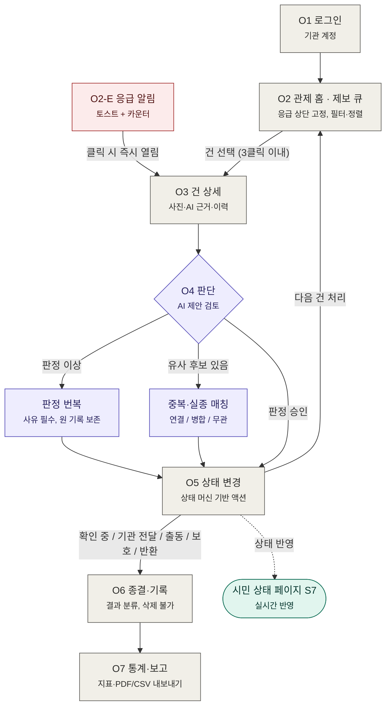
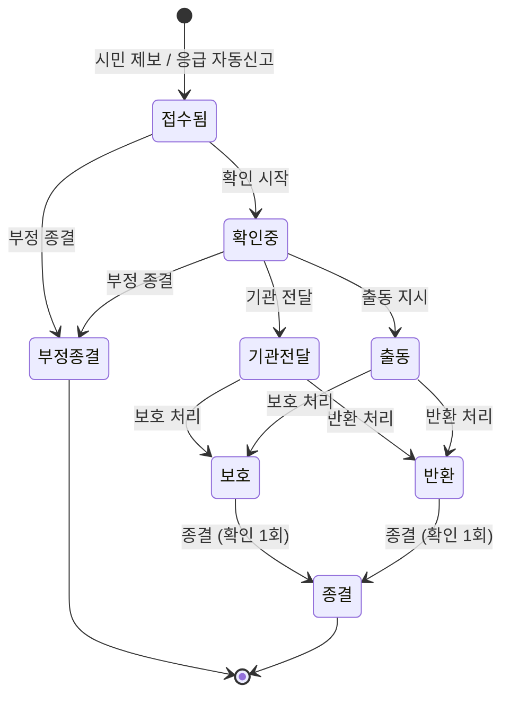

# doglink 운영자 플로우차트

> 기관 담당자(운영자)가 제보 큐를 확인하고 판단·조치·종결까지 처리하는 흐름.
> 상세 화면 명세는 `doglink_운영자_플로우_디자인시스템.md`를 참조한다.
> 제보자 플로우차트(`doglink_제보자_플로우차트.md`)와 짝을 이루며, 두 플로우는 상태 데이터로 연결된다.

---

## 1. 메인 플로우차트 (Mermaid)



색 의미: 보라 = AI 제안·사람 확정 영역 · 빨강 = 응급 경로 · 초록 = 시민 화면 연동 · 회색 = 일반 단계

---

## 2. 처리 상태 머신 (Mermaid)

운영자가 변경할 수 있는 상태 전환의 전체 지도. 여기에 없는 전환 버튼은 UI에 노출되지 않는다.



- 모든 전환은 감사 로그에 `누가·언제·무엇을` 기록
- 응급 자동신고 건은 접수됨 상태로 유입되되 큐 최상단 고정 + 응급 카운터 반영
- 종결·부정종결 건은 큐에서 숨겨지되 필터로 조회 가능, 삭제는 존재하지 않음

---

## 3. 텍스트 플로우 (ASCII)

```
[O1 로그인]
 기관 계정
     │
     ▼
[O2 관제 홈 · 제보 큐] ◀───────────── 다음 건 처리 ─────────┐
 응급 상단 고정, 필터·정렬                                  │
     │                                                      │
  건 선택                    [O2-E 응급 알림]                │
     │                        토스트 + 카운터                │
     │                              │                       │
     ▼                        클릭 시 즉시                   │
[O3 건 상세] ◀──────────────────────┘                       │
 사진 · AI 근거 · 이력                                       │
     │                                                      │
     ▼                                                      │
[O4 판단] ──판정 이상──▶ [판정 번복: 사유 필수]              │
     │    ──유사 후보──▶ [매칭: 연결/병합/무관]              │
  판정 승인                     │                            │
     │◀─────────────────────────┘                           │
     ▼                                                      │
[O5 상태 변경] ─── 상태 반영 ···▶ (시민 상태 페이지 S7)      │
 상태 머신 기반 액션 ────────────────────────────────────────┘
     │
     ▼
[O6 종결·기록]
 결과 분류, 삭제 불가
     │
     ▼
[O7 통계·보고]
 지표 · PDF/CSV 내보내기
```

---

## 4. 단계별 요약

| 단계 | 화면 | 핵심 행동 | 규칙 |
|---|---|---|---|
| O1 | 로그인 | 기관 계정 인증 | 공공 SSO 연동 대비 구조 |
| O2 | 관제 큐 | 건 스캔·선택 | 응급 최상단 고정, 키보드 탐색(↑↓/Enter), 필터 공유 |
| O2-E | 응급 알림 | 토스트 클릭 → 상세 | 자동 소멸 없음, 15분+ 미처리 시 경과 시간 병기 |
| O3 | 건 상세 | 사진·근거·이력 확인 | AI 판정 근거와 신뢰도 항상 노출 |
| O4 | 판단 | AI 제안 승인/번복/매칭 | AI는 제안만, 확정은 사람. 번복 사유 필수, 원 기록 보존 |
| O4-M | 매칭 | 연결/병합/무관 선택 | 자동 병합 금지, 병합 미리보기 후 확정, 취소 가능 |
| O5 | 상태 변경 | 액션 바 원클릭 | 상태 머신에 있는 전환만 활성, 시민 화면 실시간 반영 표기 |
| O6 | 종결·기록 | 결과 분류 선택 | 보호소 인계/반환/자연 복귀/오인/기타. 삭제 불가 |
| O7 | 통계·보고 | 지표 확인·내보내기 | 초동 대응 시간·번복률 등, 수치에 기준 정의 병기 |

## 5. 핵심 불변 규칙

- **Emergency Never Buried**: 응급 건은 어떤 필터·정렬에서도 인지 가능 (카운터 + 상단 고정 + 토스트)
- **3클릭 처리**: 큐 → 상세 → 상태 변경까지 3클릭 이내, 키보드 단축키(E/P/R/A) 병행
- **AI Proposes, Human Decides**: 자동 병합·자동 상태 변경 경로 없음. 번복·병합은 항상 사람이 수행
- **감사 추적**: 모든 판단·변경이 로그에 남고, 삭제 기능은 존재하지 않는다 (공공 기록 보존)
- **시민 연동**: O5의 상태 변경은 시민 상태 확인 페이지(S7)에 실시간 반영되며, 성공 토스트에 반영 사실을 표기
