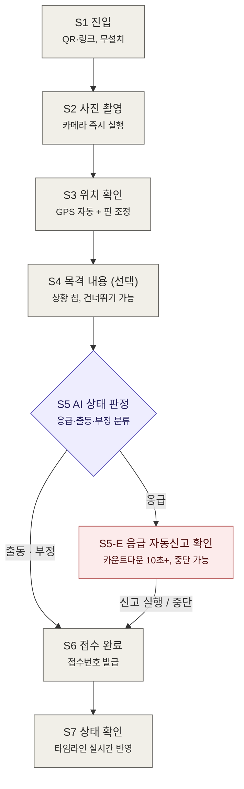

# doglink 제보자 플로우차트

> 시민(제보자)이 QR/링크로 진입해 제보를 완료하고 상태를 확인하기까지의 흐름.
> 상세 화면 명세는 `doglink_제보자_플로우_디자인시스템.md`를 참조한다.

---

## 1. 플로우차트 (Mermaid)



색 의미: 보라 = AI 판정 · 빨강 = 응급 경로 · 회색 = 일반 단계

---

## 2. 텍스트 플로우 (ASCII)

```
[S1 진입]
 QR·링크, 무설치
      │
      ▼
[S2 사진 촬영]
 카메라 즉시 실행
      │
      ▼
[S3 위치 확인]
 GPS 자동 + 핀 조정
      │
      ▼
[S4 목격 내용 (선택)]
 상황 칩, 건너뛰기 가능
      │
      ▼
[S5 AI 상태 판정] ──응급──▶ [S5-E 자동신고 확인]
 응급·출동·부정 분류          카운트다운, 중단 가능
      │                            │
   출동·부정                  신고 실행/중단
      │                            │
      ▼                            │
[S6 접수 완료] ◀───────────────────┘
 접수번호 발급
      │
      ▼
[S7 상태 확인]
 타임라인 실시간 반영
```

---

## 3. 단계별 요약

| 단계 | 화면 | 핵심 행동 | 규칙 |
|---|---|---|---|
| S1 | 진입 | "제보 시작하기" 탭 | 무설치·무가입, 첫 화면 이해 5초 이내 |
| S2 | 사진 촬영 | 카메라 촬영 또는 업로드 | 사진 1장 필수, 최대 3장, 진행률 표시 |
| S3 | 위치 확인 | GPS 확인 + 핀 미세조정 | 권한 거부 시 주소 검색 폴백 |
| S4 | 목격 내용 | 상황 칩 선택 / 자유 서술 | 완전 선택 사항, 건너뛰기 가능 |
| S5 | AI 판정 | 판정 카드 확인 | 근거 요약 + "담당자 최종 확인" 고지 + 수정 진입점 필수 |
| S5-E | 응급 확인 | 자동신고 실행 또는 중단 | 카운트다운 10초 이상, 중단 버튼 동등 접근성 |
| S6 | 접수 완료 | 접수번호 저장·공유 | 회원가입·앱 설치 유도 금지 |
| S7 | 상태 확인 | 처리 타임라인 열람 | 위치는 범위로만 공개, 초 단위 타임스탬프 |

## 4. 분기 규칙

- **응급** → S5-E 진입. 신고 실행 또는 "응급이 아니에요" 중단 모두 S6으로 합류 (중단 시 일반 접수로 전환)
- **출동** → S6으로 직행, 구조 출동 큐에 등록
- **부정** → S6으로 직행, "대응이 필요하지 않은 것으로 보이지만 기록은 남겨둘게요" 안내 후 접수
- 어떤 판정이 나와도 제보는 반드시 접수된다 — 유실되는 경로는 존재하지 않는다
- AI 분석 10초 초과 시 판정 없이 접수 진행 (폴백)
